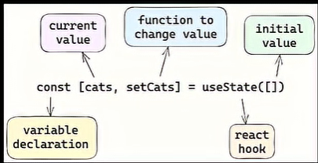

# <p align="center"> Building UI with Components (Core Concepts) </p>

## React core concepts
There are three core concepts of React that you'll need to be familiar with to start building React applications. 

**These are:**
- Components
- Props
- State


## Components
The building blocks of your app. Instead of writing one giant webpage, you break your User Interface (UI) down into small, isolated, reusable functions (e.g., a `Navbar`, a `Button`, or a `ProfileCard`).
### Creating components
In React, components are functions. Inside your `script `tag, create a new function called `header`.

[Playground File - 05_index.html](./src/05_index.html)

- To render this component to the DOM, pass it as the first argument in the `root.render()` method.
- But, wait a second. If you try to run the code above in your browser, you'll get an error. To get this to work, there are two things you have to do:
    1. React components should be capitalized to distinguish them from plain HTML and JavaScript: [Playground File - 05_index.html (Detail-2)](./src/05_index.html)
    2. you use React components the same way you'd use regular HTML tags, with angle brackets `<>`: [Playground File - 05_index.html (Detail-3)](./src/05_index.html)

### Nesting components
Applications usually include more content than a single component. You can nest React components inside each other like you would regular HTML elements.

In your example, create a new component called `HomePage`: [Playground File - 05_index.html (Detail-4)](./src/05_index.html)

---
## Props - Displaying Data with Props (Properties)

So far, if you were to reuse your `<Header />` component, it would display the same content both times.
```html
function Header() {
  return <h1>Develop. Preview. Ship.</h1>;
}
 
function HomePage() {
  return (
    <div>
      <Header />
      <Header />
    </div>
  );
}
```
- But what if you want to pass different text or you don't know the information ahead of time because you're fetching data from an external source?
- Regular HTML elements have attributes that you can use to pass pieces of information that change the behavior of those elements.
    - **For Example:**
        - Changing the `src` attribute of an `` element changes the image that is shown. 
        - Changing the `href` attribute of an `<a>` tag changes the destination of the link.
- In the same way, you can pass pieces of information as properties to React components. These are called **props**.
### Using props
In your `HomePage` component, you can pass a custom `title` prop to the `Header` component, just like you'd pass HTML attributes: [Playground File - 05_index.html (Detail-5)](./src/05_index.html)

### Using variables in JSX
You can add any JavaScript expression (something that evaluates to a single value) inside curly braces.
1. An **object property** with dot notation:
    ```js
    function Header(props) {
    return <h1>{props.title}</h1>;
    }
    ```
2. A **template literal**:
    ```js
    function Header({ title }) {
    return <h1>{`Cool ${title}`}</h1>;
    }
    ```
3. The **returned value of a function**:
    ```js
    function createTitle(title) {
    if (title) {
        return title;
    } else {
        return 'Default title';
    }
    }
    
    function Header({ title }) {
    return <h1>{createTitle(title)}</h1>;
    }
    ```
4. Or **ternary operators**:
    ```js
    function Header({ title }) {
    return <h1>{title ? title : 'Default Title'}</h1>;
    }
    ```
### Iterating through lists
Add the following array of names to your HomePage component: [Playground File - 05_index.html (Detail-6)](./src/05_index.html)
- If you run this code, React will give us a warning about a missing `key` prop. This is because React needs something to uniquely identify items in an array so it knows which elements to update in the DOM.

--- 
## State - Adding Interactivity with State
**Props** are used to pass data *into* a component from the outside, **State** is a component's internal memory. It stores information that can change over time-usually because a user clicks, types, or interacts with the page.

Let's explore how React helps us add interactivity with **state** and **event handlers**.

**Example:** Let's create a "Like" button inside your `HomePage` component. First, add a button element inside the `return()` statement: [Playground File - 05_index.html (Detail-7)](./src/05_index.html)

### Listening to events
To make the button do something when clicked, you can use the `onClick` event: [Playground File - 05_index.html (Detail-8)](./src/05_index.html)

### State and hooks
React has a set of functions called **hooks**. 
- Hooks allow you to add additional logic such as state to your components.
- You can think of state as any information in your UI that changes over time, usually triggered by user interaction.

    <div align="center">
    
    </div>

- You can use state to store and increment the number of times a user has clicked the "Like" button. In fact, the React hook used to manage state is called: `useState()`
- Add `useState()` to your project. It returns an array, and you can access and use those array values inside your component using **array destructuring**:
    ```js
    function HomePage() {
    // ...
    const [] = React.useState();
    
    // ...
    }
    ```
    1. The first item in the array is the state value, which you can name anything. It's recommended to name it something descriptive:
        ```js
        function HomePage() {
        // ...
        const [likes] = React.useState();
        
        // ...
        }
        ```
    2. The second item in the array is a function to update the value. You can name the update function anything, but it's common to prefix it with set followed by the name of the state variable you're updating:
        ```js
        function HomePage() {
        // ...
        const [likes, setLikes] = React.useState();
        
        // ...
        }
        ```
    <div align="center">
    
    </div>

    - You can also take the opportunity to add the initial value of your likes state to 0:
        ```js
        function HomePage() {
            // ...
            const [likes, setLikes] = React.useState(0);
        }
        ```
- [Playground File - 05_index.html (Detail-9)](./src/05_index.html)

--- 